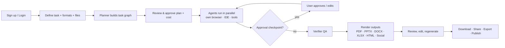
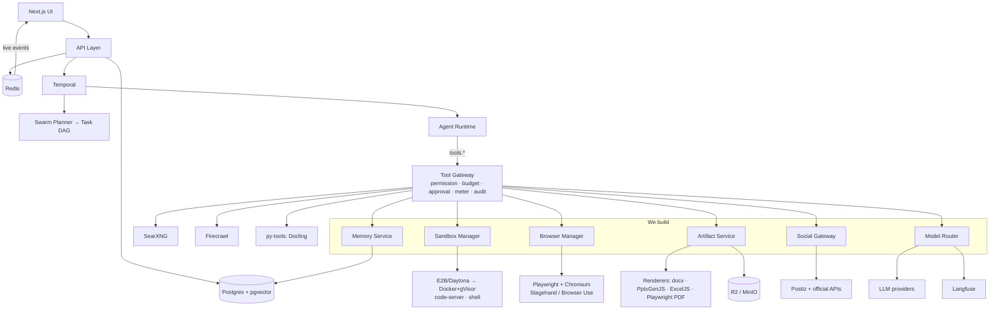
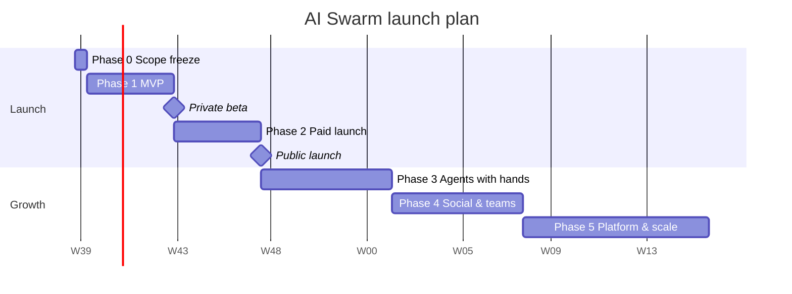

# AI Swarm: Project Plan and Complete Feature Specification

> **Product:** A multi-agent SaaS. The user describes any task. The platform splits it into subtasks and assigns each to a specialist agent with its own browser, IDE and tools. The agents work in parallel, results are verified, and finished deliverables come back (PDF, PPTX, DOCX, XLSX, HTML sites, social posts, code).

---

## 1. Vision and Scope

| Item | Definition |
|---|---|
| **Problem** | Complex work (research, content, web builds, campaigns) takes many tools, many people and many hours. Chatbots answer; they don't *deliver*. |
| **Solution** | A swarm of AI agents that plans, executes, verifies and packages work into ready-to-use files. |
| **Primary users** | Agencies, design studios, marketers, founders, consultants, researchers, students. |
| **Positioning** | **SaaS Launch: an AI product team for solo founders** (Validate → Plan → Build → Launch → Operate). See `POSITIONING.md`. |
| **Launch task families** | Phase 1: Validate + Plan (research, competitors, pricing, PRD, pitch deck → PDF/DOCX/PPTX) · Phase 2: Launch kit (SEO, content, social/Reddit/PH drafts) · Phase 3: Build (Next.js app, QA, deploy) · Phase 5: Operate loop. |
| **Business model** | Subscription + usage credits, BYOK option, Enterprise plan. |

---

## 2. User Roles

| Role | Can do |
|---|---|
| **Guest** | View landing page, pricing, public shared outputs |
| **Member (Viewer)** | View projects and outputs, comment |
| **Editor** | Create swarms, edit plans, approve drafts, download outputs |
| **Admin** | Manage members, brand kits, integrations, social accounts, billing |
| **Owner** | Everything, including deleting the org and transferring ownership |
| **Platform Super-Admin** | Internal: manage all tenants, plans, models, abuse, support |

---

## 3. Feature Modules

### Module A: Marketing Website
- A1. Landing page (hero, how-it-works, agent library, use cases, integrations, security, pricing, FAQ, CTA)
- A2. Pricing page with plan comparison and a credit calculator
- A3. Template gallery (public previews of outputs)
- A4. Blog / docs / changelog
- A5. Public shared-output pages (view-only links)
- A6. SEO: meta tags, OG images, sitemap, schema markup
- A7. Waitlist / contact sales form

### Module B: Authentication and Accounts
- B1. Email + password sign-up with email verification
- B2. OAuth login (Google, GitHub, Microsoft)
- B3. Password reset, magic-link login
- B4. Two-factor authentication (TOTP)
- B5. SSO / SAML (Enterprise)
- B6. Session management (active devices, sign out everywhere)
- B7. Profile: name, avatar, timezone, language, notification preferences
- B8. Account deletion and data export

### Module C: Organizations and Teams
- C1. Create multiple organizations/workspaces; switch between them
- C2. Invite members by email or link; role assignment (Viewer/Editor/Admin/Owner)
- C3. Team folders / project spaces
- C4. Per-member usage limits
- C5. Activity feed for the org
- C6. Org-level settings (default models, default brand kit, data retention)

### Module D: Task Input ("Define")
- D1. Natural-language task box ("Build a landing page + pitch deck for my coffee brand")
- D2. Task templates (Market research, Competitor analysis, Landing page, Pitch deck, Social calendar, SEO audit, Blog series, Product spec, Excel model)
- D3. Output format picker: PDF, PPTX, DOCX, XLSX, Markdown, HTML site, ZIP code, social posts (multi-select)
- D4. Parameters: audience, tone, length, language, region, deadline, depth (quick/standard/deep)
- D5. File uploads as context (PDF, DOCX, PPTX, XLSX, CSV, images, ZIP)
- D6. URL inputs (websites to analyze, reference designs)
- D7. Brand kit selection
- D8. Source constraints (allowed/blocked domains, academic only, date range)
- D9. Budget cap per task (max credits / max time)
- D10. Voice input for the task
- D11. Prompt improver: AI suggests a clearer task description

### Module E: Planner and Task Decomposition
- E1. Planner agent converts the task into a **task graph (DAG)** of subtasks
- E2. Each subtask includes role, objective, tools, dependencies, expected output, estimated cost
- E3. Visual plan graph (nodes and edges) showing parallel and sequential work
- E4. User can edit the plan: add/remove/rename agents, change dependencies, change models
- E5. Cost and time estimate before running
- E6. Plan approval step (human-in-the-loop)
- E7. Plan validation (no cycles, known roles, within budget)
- E8. Save plan as reusable template
- E9. Re-planning during a run when a subtask fails or the verifier rejects output

### Module F: Agent Library
- F1. Built-in roles: Lead/Planner, Web Researcher, Domain Specialist, Data Analyst, Fact-Checker, Writer, Editor, Translator, Frontend Developer, Backend Developer, Designer (slides/graphics), Excel Specialist, SEO Specialist, Social Media Manager, Image Creator, Verifier/QA, Synthesizer
- F2. Custom agents: name, persona, system prompt, tools, model, avatar
- F3. Skills: upload instruction packs that agents load (e.g. "REDS brand voice", "APA citations")
- F4. Community skill/agent marketplace (browse, install, rate, publish)
- F5. Agent versioning
- F6. Per-agent model choice (fast/cheap vs strong/accurate)
- F7. Agent performance stats (success rate, avg cost, avg time, user ratings)

### Module G: Orchestration Engine
- G1. Durable workflows (Temporal): retries, timeouts, resume after crash
- G2. Parallel execution of independent subtasks, with a concurrency cap per plan
- G3. Typed artifact hand-off between agents (summary + file reference, not raw text dumps)
- G4. Pause / resume / cancel a run
- G5. Mid-run instructions ("focus on India market") via chat
- G6. Human approval checkpoints (after plan, after research, before publish)
- G7. Escalation: agent asks the user a question when blocked
- G8. Budget enforcement: hard stop at credit/time limit
- G9. Re-run a single agent, section or slide without redoing the whole run
- G10. Scheduled / recurring runs (daily, weekly, monthly)
- G11. Priority queues per plan tier
- G12. Event triggers (webhook, new file in Drive, RSS item)

### Module H: Agent Workspace (Own Browser, Own IDE)
- H1. **Isolated sandbox per agent** (container/microVM), created on demand, destroyed after use
- H2. **Own browser:** headless Chromium via Playwright, with AI control through Stagehand (or Browser Use), all behind our Browser Manager. The agent can navigate, click, fill forms, scroll, screenshot and extract.
- H3. **Live browser view:** user watches the agent's browser in real time and can take control
- H4. **Own IDE:** code-server (VS Code in the browser) inside the sandbox, with file tree and terminal
- H5. **Shell access:** run commands, install packages, run scripts (sandboxed)
- H6. **HTML/CSS/JS live preview:** agent builds files, starts a local server and opens them in its browser. The user gets a preview URL.
- H7. Visual self-check: agent screenshots its own output and fixes layout issues
- H8. Sandbox filesystem: per-task workspace, downloadable as ZIP
- H9. Resource limits: CPU, RAM, disk, time, network allow-list
- H10. Secrets injected per call (never stored inside the sandbox)

### Module I: Tools Available to Agents
- I1. Web search: `tools.web.search` → SearXNG (+ optional paid search APIs)
- I2. Web fetch/crawl: `tools.web.fetch/crawl` → Firecrawl, with Playwright fallback for JS-heavy pages
- I3. Document reading: `tools.documents.parse` → Docling service (PDF, DOCX, PPTX, XLSX, HTML)
- I4. Code execution (Python, Node)
- I5. Data analysis and chart generation
- I6. Image generation and editing
- I7. Screenshot and vision analysis
- I8. File read/write in sandbox
- I9. Memory search (project knowledge base)
- I10. Integration tools (Drive, Notion, Slack, GitHub, email)
- I11. Social media tools (read analytics, draft, schedule; publish after approval)
- I12. **Tool Gateway:** every tool call is permission-checked, metered, logged and approval-gated if it has side effects

### Module J: Live Run View ("Run")
- J1. Agent graph with live status (idle, working, waiting, blocked, done, error)
- J2. Per-agent progress bar and current action
- J3. Live timeline log (thoughts, searches, URLs visited, notes, hand-offs)
- J4. Live browser stream and IDE view per agent
- J5. Live cost / token / time ticker
- J6. Sources collected in real time
- J7. Chat panel to talk to the swarm mid-run
- J8. Notifications on completion (in-app, email, push, Slack)

### Module K: Output Generation
- K1. **PDF** reports (HTML → PDF with themes, cover page, TOC, page numbers, citations)
- K2. **PPTX** presentations (layouts, charts, images, speaker notes, brand theme)
- K3. **DOCX** documents (headings, tables, footnotes, citations, TOC)
- K4. **XLSX** spreadsheets (formulas, charts, multiple sheets, formatting)
- K5. **Markdown** documents
- K6. **HTML websites** (multi-page, responsive, deployable, ZIP download)
- K7. **Code projects** (ZIP or push to GitHub)
- K8. **Social posts** (captions, hashtags, images, carousels, platform-specific sizes)
- K9. Images / infographics (PNG, SVG)
- K10. Brand kit applied to every output (logo, colors, fonts, templates)
- K11. Template library per format
- K12. Visual QA: rendered output checked by a vision model for overflow, empty slides and broken layout
- K13. Multi-language output

### Module L: Output Review and Editing ("Output")
- L1. In-app viewer for every format (slides, docs, PDF, sheets, site preview)
- L2. In-app editor (edit text, swap images, reorder slides)
- L3. "Regenerate this section/slide" with instructions
- L4. Source panel: every claim linked to its evidence and URL
- L5. Confidence / verification badges on claims
- L6. Version history and compare versions
- L7. Comments and mentions on outputs
- L8. Download in any format; export to Drive/Notion/email
- L9. Share links (view-only, password, expiry)
- L10. Rate output (feeds quality analytics)

### Module M: Research and Evidence
- M1. Search results stored per project with rank and engine
- M2. Evidence records: quote, source, URL, date, agent
- M3. Reference manager (APA, MLA, Vancouver, Harvard styles)
- M4. Source quality scoring and blocked-domain lists
- M5. Deduplication of sources
- M6. Fact-check report per deliverable
- M7. Export bibliography

### Module N: Social Media
- N1. Connect accounts via official OAuth (Instagram, Facebook, LinkedIn, X, YouTube, Pinterest, Threads) or Postiz
- N2. AI-generated content calendar
- N3. Post drafts with preview mockups per platform
- N4. Approval workflow: drafter → reviewer → publisher
- N5. Scheduling and auto-publish (after approval only)
- N6. Analytics import (reach, engagement, followers)
- N7. Trend and competitor monitoring
- N8. Comment/DM reply suggestions (human sends)
- N9. Hashtag and best-time-to-post recommendations

### Module O: Projects and Knowledge
- O1. Project list with search, filters, tags, status
- O2. Project detail: goal, plan, run history, outputs, sources, cost
- O3. Project memory: uploaded files, past outputs and brand context reused across runs (vector store)
- O4. Duplicate project / run again with changes
- O5. Archive and delete
- O6. Folder organization

### Module P: AI Chat
- P1. Standalone chat with any configured model
- P2. Chat history, pin, rename, search
- P3. "Turn this chat into a swarm task"
- P4. Chat with a project's files and outputs

### Module Q: Integrations and Developer Platform
- Q1. Google Drive, OneDrive, Dropbox (import/export)
- Q2. Notion, Confluence (export)
- Q3. Slack, Microsoft Teams, Discord (notifications, start tasks)
- Q4. GitHub (push code outputs, open PRs)
- Q5. Email (send deliverables)
- Q6. Zapier / Make.com connectors
- Q7. Public REST API (create task, get status, download outputs)
- Q8. Webhooks (run started, completed, failed, approval needed)
- Q9. SDKs (JavaScript, Python)
- Q10. API keys management with scopes
- Q11. MCP server support: connect external tools to agents

### Module R: Models and AI Providers
- R1. Multi-provider support (Anthropic, OpenAI, Google, OpenRouter, NVIDIA, open-source, custom endpoint)
- R2. BYOK: user adds their own API keys (encrypted)
- R3. Model router: cheap model for simple steps, strong model for planning/writing/verification
- R4. Automatic fallback when a model fails or is rate-limited
- R5. Per-agent and per-org default models
- R6. Prompt caching and context compression

### Module S: Billing and Usage
- S1. Plans: Free, Pro, Team, Enterprise
- S2. Subscriptions via Stripe (global) and Razorpay (India)
- S3. Credit system: tokens + sandbox minutes + searches + renders + storage
- S4. Credit top-ups and auto-recharge
- S5. Usage dashboard (per project, per agent, per member, per model)
- S6. Invoices, GST/VAT handling, billing history
- S7. Quotas: concurrent runs, agents per run, storage, social accounts
- S8. Budget alerts
- S9. Coupons, trials, referral credits

### Module T: Dashboard and Analytics
- T1. Home dashboard: recent projects, active runs, credits left, quick-start templates
- T2. Usage analytics: tokens, cost, runs over time
- T3. Agent analytics: success rate, avg time, avg cost
- T4. Model analytics: usage share, error rate, latency
- T5. Output quality analytics: ratings, regenerations, verifier scores
- T6. System status panel

### Module U: Notifications
- U1. In-app notification center
- U2. Email notifications (run complete, approval needed, low credits)
- U3. Browser push notifications
- U4. Slack/Teams notifications
- U5. Per-user notification preferences

### Module V: Security, Safety and Compliance
- V1. Tenant isolation (org-scoped data + Postgres Row-Level Security)
- V2. Encryption at rest and in transit; KMS for API keys and social tokens
- V3. Sandbox isolation (no host access, egress allow-list, no metadata endpoint)
- V4. Prompt-injection defenses: tool output treated as untrusted, never escalates permissions
- V5. Approval gates for all side-effect actions (publish, send email, push code, spend above limit)
- V6. Immutable audit log of every tool call, approval and publish
- V7. Abuse detection (spam, scraping, malware, crypto mining in sandboxes)
- V8. Rate limiting and bot protection
- V9. Data retention controls and right-to-delete
- V10. Compliance: India DPDP Act, GDPR, SOC 2 readiness
- V11. Content moderation on inputs and outputs

### Module W: Settings
- W1. Profile and preferences
- W2. Theme (light/dark), language
- W3. Model/provider credentials
- W4. Brand kits (logo, colors, fonts, templates)
- W5. Integrations and connected social accounts
- W6. API keys and webhooks
- W7. Members and roles
- W8. Billing and plan
- W9. Security (2FA, sessions, SSO)
- W10. Data and privacy (export, delete, retention)

### Module X: Platform Admin (Internal)
- X1. Tenant list, plan overrides, credit adjustments
- X2. Model catalog and pricing configuration
- X3. Global agent/template/skill management
- X4. Abuse review queue, user suspension
- X5. System health: queues, workers, sandbox pool, error rates
- X6. Support tools: view run (with consent), impersonate (audited)
- X7. Feature flags

### Module Y: Quality and Evaluation
- Y1. Verifier/critic agent with a rubric per output type
- Y2. Evaluation suite of fixed benchmark tasks, run on every prompt/model change
- Y3. Quality score history over time
- Y4. User feedback loop (ratings → prompt improvements)
- Y5. A/B testing of prompts and models

### Module Z: Infrastructure and Operations
- Z1. Next.js app (frontend + API)
- Z2. PostgreSQL + Prisma
- Z3. Temporal cluster + horizontally scaled workers
- Z4. Sandbox Manager with provider adapter: E2B/Daytona (managed) → Docker + gVisor → Firecracker
- Z5. Object storage (S3 / Cloudflare R2 / MinIO) for artifacts
- Z6. Redis for caching, rate limits, pub/sub for live updates
- Z7. Vector DB (pgvector) for memory
- Z8. SearXNG for search
- Z9. Render service: Playwright PDF, PptxGenJS, docx, ExcelJS (no LLM-written file code)
- Z13. `py-tools` service (FastAPI): Docling, and Browser Use if chosen
- Z14. Langfuse LLM tracing, OpenTelemetry once multi-service
- Z10. Observability: OpenTelemetry, Langfuse (LLM traces), Sentry, uptime monitoring
- Z11. CI/CD, staging, automated tests, DB backups, disaster recovery
- Z12. Public status page

---

## 4. Core User Flow



---

## 5. System Architecture



---

## 6. Data Model (Entities)

User · Organization · Membership · Session · ApiKey · ProviderCredential · BrandKit · Project · TaskPlan · TaskNode · AgentDefinition · ProjectAgent · Skill · Sandbox · TimelineEvent · SearchResult · Source · Evidence · Reference · Artifact · Section · Slide · Approval · SocialAccount · SocialPost · Chat · ChatMessage · Schedule · Webhook · Integration · UsageEvent · CreditLedger · Subscription · Invoice · Notification · Comment · ShareLink · AuditLog · FeatureFlag

---

## 7. Pages / Screens

| Page | Purpose |
|---|---|
| `/` | Landing page |
| `/pricing`, `/templates`, `/docs`, `/blog` | Marketing |
| `/login`, `/register`, `/forgot-password`, `/verify` | Auth |
| `/dashboard` | Home: recent projects, active runs, credits |
| `/new-swarm` | Define → Plan → Run → Output flow |
| `/projects`, `/projects/[id]` | Project list and detail |
| `/projects/[id]/run` | Live run view |
| `/projects/[id]/output` | Output viewer/editor |
| `/agents` | Agent library + custom agents |
| `/skills` | Skills + marketplace |
| `/templates` (app) | Task and output templates |
| `/social` | Calendar, drafts, approvals, analytics |
| `/chat` | AI chat |
| `/integrations` | Connected apps |
| `/analytics` | Usage, agents, models, quality |
| `/settings/*` | Profile, org, members, billing, brand kits, API keys, security |
| `/share/[token]` | Public shared output |
| `/admin/*` | Platform admin |

---

## 8. Build vs Buy: Technology Decisions

**Rule:** use open source for commodity infrastructure. Build the orchestration, the Tool Gateway, the agent runtime, permissions, the artifact pipeline and the product UX. Those are the product and the IP.

### 8.1 What we BUILD (our product layer)

| Component | What it does | Built in phase |
|---|---|---|
| **Swarm Planner** | Task → validated task DAG (role, objective, tools, deps, budget) | 1 |
| **Task DAG runner** | Topological scheduler on top of Temporal child workflows | 1 |
| **Agent Runtime** | One `AgentRuntime` interface: `execute(task)`, `tools`, `workspace`, optional `browser` | 1 (thin) → 3 (full) |
| **Tool Gateway** | Every tool call goes through it: permission → budget → approval → route → meter → audit | 1 (thin) → 3 (full) |
| **Permission Engine** | Per-agent tool and domain allow-lists, per-org policy | 1 (basic) → 3 |
| **Approval Engine** | Human-in-the-loop for side effects (publish, email, PR, overspend) | 2 (plan approval) → 4 (social) |
| **Agent Registry / Skill Registry** | Built-in + custom roles, skills, versions | 1 (built-in) → 5 (custom/marketplace) |
| **Artifact Service** | Typed, versioned artifacts (`id, projectId, type, version, uri, createdByAgent, parentArtifact, metadata`) | 1 |
| **Document / Slide / Sheet Schemas** | Structured JSON the LLM fills in. Renderers turn it into files. | 1 (doc, slide) → 2 (sheet) |
| **Template Engine + Brand Kit + Layout Engine** | Themes applied to every renderer | 1 (1 theme) → 2 (brand kits) |
| **Visual QA / Verifier** | Render → screenshot → vision check → fix | 2 |
| **Memory Service** | `store / search / update / delete / getProjectContext` on pgvector | 2 |
| **Sandbox Manager** | `POST /sandboxes` with CPU/RAM/disk/network policy. Provider adapter (managed first, self-hosted later). | 3 |
| **Browser Manager** | `BrowserSession`, profiles, permissions, recording, live streaming | 3 |
| **Social Gateway** | `social.getProfile / getAnalytics / createDraft / schedule / publish` over Postiz + official APIs | 4 |
| **Cost / Metering Engine** | Tokens, searches, renders, sandbox-minutes → credit ledger | 1 (budget cap) → 2 (billing) |
| **Audit Log** | Immutable record of every tool call, approval, publish | 1 (via gateway) |
| **Evaluation System** | Fixed eval tasks, rubric scoring, regression tracking | 1 |
| **Project System + SaaS UI** | Everything the user sees | 1 onwards |

### 8.2 What we DON'T build (open source / managed)

| Job | Use | License / note | Phase |
|---|---|---|---|
| Durable workflows | **Temporal** | MIT. Already in repo. | 1 |
| Database | **PostgreSQL** (Neon/Supabase managed) | — | 1 |
| Vector memory | **pgvector** | Same Postgres, no separate vector DB | 2 |
| Cache / live events | **Redis** (Upstash managed) | — | 1 |
| Search | **SearXNG** | AGPL-3.0. Run unmodified as a separate service. | 1 |
| Page fetch / crawl | **Firecrawl** (hosted API first) | AGPL-3.0 if self-hosted. See §8.4. | 1 |
| JS-heavy pages, screenshots, PDF | **Playwright + Chromium** | Apache-2.0 | 1 |
| AI browser control | **Stagehand** (TypeScript) *or* **Browser Use** (Python) | Both MIT. See §8.4. | 3 |
| Document ingestion | **Docling** (Python service) | MIT code. Check model licenses. Pin a patched version. | 2 |
| DOCX output | **docx** (npm) | MIT | 1 |
| PPTX output | **PptxGenJS** | MIT | 1 |
| XLSX output | **ExcelJS** | MIT | 2 |
| PDF output | **Playwright `page.pdf()`** (HTML + print CSS) | One engine only. See §8.4. | 1 |
| Sandbox | **E2B / Daytona** (managed) → **Docker + gVisor** → **Firecracker** | Behind the Sandbox Manager adapter | 3 → 5 |
| IDE | **code-server** | MIT | 3 |
| Artifact storage | **Cloudflare R2** (prod) / **MinIO** (local) | S3 API for both | 1 |
| LLM tracing | **Langfuse** | MIT core. Cheap to add early. | 1 |
| Errors / product analytics | **Sentry**, **PostHog** | Managed | 1 |
| Observability | **OpenTelemetry** | Add when there are multiple services | 3 |
| Social publishing | **Postiz** + official APIs | AGPL-3.0. See §8.4. | 4 |
| LLMs, image models | Providers via our model router | Never self-train | 1 |

### 8.3 The universal tool interface (most important design rule)

Agents never import Playwright, Firecrawl, Docling or Postiz. They only see:

```ts
await tools.web.search(q)            // → SearXNG
await tools.web.fetch(url)           // → Firecrawl → Playwright fallback
await tools.web.crawl(url, opts)     // → Firecrawl
await tools.browser.open(url)        // → Browser Manager → Playwright/Stagehand   (Phase 3)
await tools.browser.click(target)
await tools.code.execute(cmd)        // → Sandbox Manager                          (Phase 3)
await tools.files.read(path)
await tools.documents.parse(fileId)  // → Docling service                          (Phase 2)
await tools.documents.create(schema) // → Artifact Service → docx / PptxGenJS / ExcelJS / Playwright PDF
await tools.memory.search(q)         // → Memory Service → pgvector                (Phase 2)
await tools.social.analytics(acct)   // → Social Gateway → Postiz / APIs           (Phase 4)
await tools.social.publish(post)     // → Approval Engine first, always
```

Every call has the same envelope, and the Tool Gateway evaluates it:

```json
{ "runId": "run_1", "agent": "researcher-01", "tool": "web.fetch", "args": { "url": "https://example.com" } }
```

```text
Permission? → Domain allowed? → Budget left? → Side effect? ─yes→ Approval queue
                                                    └─no→ Route → Execute → Meter → Audit
```

Any implementation (Firecrawl → own crawler, E2B → gVisor, Postiz → direct APIs) can be swapped later without touching agents.

### 8.4 Stack decisions and cautions

1. **Build order stays launch-first.** Tool Gateway → Sandbox → Browser → Runtime → Planner would put ~8–10 weeks of infrastructure before anything a user can pay for. Launch (research → PDF/DOCX/PPTX) needs **no sandbox and no browser**. So in Phase 1 we build the **interfaces** (`tools.*`, Tool Gateway, AgentRuntime, Artifact Service) as thin versions. Retrofitting them later is expensive, and building them thin is cheap. The heavy implementations (sandboxes, browser sessions) come in Phase 3.
2. **AGPL components (SearXNG, Firecrawl self-host, Postiz).** Running them *unmodified* as separate network services is the usual approach. If you *modify* them and serve users, AGPL requires publishing those modifications. Keep them as separate services behind the gateway. Never copy their code into our codebase. Check each project's LICENSE file (and get legal advice) before the paid launch.
3. **Python vs TypeScript.** The stack is TypeScript, but Docling and Browser Use are Python. Run **one `py-tools` service** (FastAPI, in Docker) for Docling (and Browser Use if chosen), called only through the gateway. For browser control, **prefer Stagehand** (TypeScript, runs next to Playwright) to avoid a second agent runtime in Python. Use Browser Use only if Stagehand falls short in Phase 3 testing.
4. **One PDF engine.** Use Playwright/Chromium (already required). Skip WeasyPrint: it adds Python, and its CSS behaves differently. **Skip Marp.** PptxGenJS covers decks.
5. **Firecrawl: hosted API first.** Self-hosted Firecrawl doesn't have all the cloud features. Use its API for the MVP. Self-host (or replace it) once volume justifies it.
6. **Postiz is already a gateway.** Our Social Gateway should be a thin adapter over it (for approval, metering, audit), not a second implementation of every platform.
7. **Keep dependencies patched.** Pin versions. Use Renovate/Dependabot. Docling had a 2026 advisory affecting some 2.8x–2.90 versions when HTML rendering through Playwright was enabled; pin to a fixed version. Parsers and browsers handle untrusted input, so update them first.

---

## 9. Phase-wise Plan (Launch ASAP)

### 9.0 Launch strategy: how "ASAP" works

**To launch quickly, most of the feature list has to wait.** The full spec above (~250 features) would take a small team a year. The fastest real launch is:

> **Launch 1 task family, done well, with real files: _Research → Report (PDF + DOCX) + Deck (PPTX)_.**

Why this one goes first:
- The codebase already has most of it: SearXNG search, evidence/sources tables, the agent roster, Temporal workflow, the slide data model, and auth.
- It needs **no sandboxes, no social APIs, and no browser automation**, which are the three slowest and riskiest parts to build.
- It is easy to demo, easy to price, and easy to judge ("is this report good?").

**Assumptions behind the dates:** 1–2 developers, part-time on this. With more people, the phases compress. With less time, the dates slip, but the **order stays the same**.

**Speed rules for every phase:**
1. Use a managed service instead of building one (hosting, DB, storage, auth emails, payments, sandboxes).
2. Ship to real users every week once the beta is out. Feedback decides what comes next, not this list.
3. Don't start a feature that isn't in the current phase.
4. Every phase ends in something users can touch.

### 9.1 Timeline overview

| Phase | Weeks | Outcome | Launch event |
|---|---|---|---|
| **Phase 0: Scope Freeze & Cleanup** | Week 0 (3–4 days) | Clean repo, decisions locked | — |
| **Phase 1: MVP** | Weeks 1–4 | Research → PDF/DOCX/PPTX works end-to-end with real files | **Private beta** (invite-only, free credits) |
| **Phase 2: Paid Launch** | Weeks 5–8 | Payments, credits, templates, brand kits, file uploads | **Public launch** (paid plans live) |
| **Phase 3: Agents with Hands** | Weeks 9–14 | Sandboxes: own browser, own IDE, HTML/CSS/JS preview → website-builder task family | Feature launch #2 |
| **Phase 4: Social & Teams** | Weeks 15–20 | Orgs/teams, social OAuth, content calendar, approvals, scheduling | Feature launch #3 |
| **Phase 5: Platform & Scale** | Week 21+ | API, webhooks, integrations, marketplace, enterprise | Ongoing |



---

### Phase 0: Scope Freeze & Cleanup (Week 0, 3–4 days)

**Goal:** stop building the wrong things and remove anything that misleads.

| Task | Done when |
|---|---|
| Lock the launch task family (Research → Report + Deck) | Written in README |
| Lock the stack and hosting: Vercel (Next.js), Neon/Supabase (Postgres), Temporal Cloud *or* one VM with Temporal, Railway/Fly (worker), Cloudflare R2 (files) | Accounts created |
| Pick paid LLM models + a budget per run (cheap model for extraction, strong model for planning, writing and verification) | `lib/llm.ts` model chain updated |
| Delete or rewrite `SWARM_OVERVIEW.md` (out of date) | File no longer contradicts the code |
| Separate demo data from the real flow (`demoData.ts` only on landing/demo) | New-swarm flow shows only real data |
| Commit the pending local changes | Clean `git status` |

---

### Phase 1: MVP (Weeks 1–4) → Private Beta

**Goal:** a stranger types a research goal, and 10–20 minutes later downloads a good PDF, DOCX and PPTX with sources.

| Week | Build | Modules |
|---|---|---|
| **Week 1: Swarm core + interfaces** | **Thin Tool Gateway** (permission check, budget check, metering, audit log; approval hook stubbed) and the universal `tools.*` interface: `web.search` (SearXNG), `web.fetch` (Firecrawl API → Playwright fallback). **AgentRuntime** interface. Planner v1 picks agents from the fixed role library and outputs a **validated task DAG (JSON + Zod)**. `executeDag` workflow runs it on Temporal and replaces the hardcoded pipeline. Per-run budget cap. Langfuse tracing. | E1–E2, E6–E7, G1–G3, G8, I1–I2, I12 (thin), R3–R4 |
| **Week 2: Artifacts + real outputs** | **Artifact Service** (typed, versioned, parent links, stored in R2). **Document and Slide schemas** (JSON the LLM fills). Renderers: **PDF** (HTML template → Playwright `page.pdf()`), **DOCX** (`docx`), **PPTX** (PptxGenJS), Markdown. One clean default theme. Download buttons. Agents hand off artifact references (no 14k truncation). | G3, K1–K3, K5, Z5, Z9 |
| **Week 3: Run & review UX** | Live run view wired to real `TimelineEvent`s (polling or SSE). Output viewer. Sources panel linking claims to evidence. "Regenerate this section/slide". Clear error states and retry. | J1–J3, J5–J6, L1, L3–L4, L8, M1–M2, M6 |
| **Week 4: Launch-ready** | Production deploy. Email verification + password reset. Free-credit limit per user (e.g. 5 runs). Sentry + PostHog. Eval set of 20 fixed research tasks run before each deploy. Landing page updated to match what really ships, plus a waitlist/invite system. | B1, B3, S7 (basic), T1, Y1–Y2, Z10–Z11, A1, A7 |

**Deliberately NOT in Phase 1:** sandboxes, browser/IDE, social media, teams/orgs, payments, XLSX, brand kits, integrations, API, marketplace, custom agents, scheduling.

**Private beta launch (end of Week 4):**
- Invite 20–50 users: agencies, consultants, students/researchers, and your own studio work as the first design partner.
- Collect a rating on every output, and hold a 15-minute call with the first 10 users.

**Go / No-Go gate for public launch:**
- ≥ 80% of runs finish without errors
- Average output rating ≥ 4/5
- Median cost per run is known (p50 and p95)
- At least 5 beta users say they'd pay

---

### Phase 2: Paid Launch (Weeks 5–8) → Public Launch

**Goal:** people can pay, and the product looks professional enough to charge for.

| Week | Build | Modules |
|---|---|---|
| **Week 5: Billing** | Razorpay (India) + Stripe (global). Plans: Free / Pro. Credit ledger (tokens + searches + renders). Top-ups. Budget alerts. Invoices with GST. | S1–S6, S8 |
| **Week 6: Better inputs + memory** | Task templates (Market research, Competitor analysis, Pitch deck, Literature review). File uploads parsed by the **Docling `py-tools` service** (`tools.documents.parse`). **Memory Service on pgvector** (uploads + past outputs searchable per project). URL inputs (`tools.web.crawl`). Source constraints enforced by the gateway domain policy. Plan review/edit screen + cost estimate (first Approval Engine use). | D2–D8, E3–E5, I3, O3, Z7, Z13 |
| **Week 7: Better outputs** | Template Engine + Brand kits (logo, colors, fonts) across all renderers. 3–4 templates per format. **Sheet schema → ExcelJS** XLSX output. Share links. Visual QA (render → Playwright screenshot → vision check → fix). | K4, K10–K12, L9, W4, Y1 |
| **Week 8: Launch polish** | Usage dashboard. Email notifications (run done, low credits). OAuth login (Google). Pricing page + credit calculator. Onboarding (first-run guided task). Docs/FAQ. | T1–T2, U1–U2, B2, A2, A4 |

**Public launch (end of Week 8):** Product Hunt, LinkedIn, X, Indian startup/agency communities, and demo videos showing a real run from goal to downloaded deck.

---

### Phase 3: Agents with Hands (Weeks 9–14)

**Goal:** agents get their **own browser, own IDE, and HTML/CSS/JS preview**. This unlocks task family #2: **Website / Landing page builder**.

| Weeks | Build | Modules |
|---|---|---|
| 9–10 | **Sandbox Manager** (`POST /sandboxes` with CPU/RAM/disk/network policy) on a managed provider (E2B/Daytona) through an adapter. Created lazily per agent, destroyed on idle. **Full Tool Gateway**: domain allow-lists, egress policy, per-call secret injection, approval queue live. `tools.code.execute`, `tools.files.*`. | H1, H5, H8–H10, I4, I8, I12, V3–V4, V6 |
| 11–12 | **Browser Manager**: `BrowserSession` (Playwright + Chromium in the sandbox), AI control through **Stagehand** (test Browser Use as fallback), recording, live stream to the UI (CDP screencast), user takeover. **code-server** IDE view. OpenTelemetry across services. | H2–H4, I7, Z14 |
| 13–14 | HTML/CSS/JS live preview URLs, visual self-check loop, website builder template, ZIP download / GitHub push. Sandbox minutes added to credits. | H6–H7, K6–K7, Q4 |

**Launch:** "AI Swarm now builds websites," with a demo of the agent coding and previewing live.

---

### Phase 4: Social & Teams (Weeks 15–20)

**Goal:** agencies can use it as a team and run social campaigns (task family #3).

| Weeks | Build | Modules |
|---|---|---|
| 15–16 | Organizations, members, roles, invites, shared projects, Team plan. Postgres RLS. | C1–C6, S1 (Team), V1 |
| 17–18 | **Social Gateway** (thin adapter over **Postiz** + official APIs): `social.getProfile / getAnalytics / createDraft / schedule / publish`. OAuth account connect. AI content calendar. Post drafts with platform previews. Image generation. | N1–N3, N9, I6, I11, K8 |
| 19–20 | Approval workflow (drafter → reviewer → publisher), scheduling, publish **only after approval**, analytics import. Comments on outputs, version history. Slack notifications. | N4–N6, L6–L7, U4, V5 |

---

### Phase 5: Platform & Scale (Week 21+)

Build based on what paying users ask for most. Candidates:
- Public API, webhooks, SDKs, API keys (Q7–Q10)
- Integrations: Drive, Notion, Slack, Zapier/Make, MCP servers (Q1–Q6, Q11)
- Custom agents, skills marketplace, agent analytics (F2–F7)
- Scheduled/recurring swarms and event triggers (G10, G12)
- Project memory / vector store (O3, Z7)
- Mid-run chat, pause/resume, escalation questions (G4–G7, J7)
- Enterprise: SSO/SAML, BYOK with KMS, audit export, private deployment (B5, R2, V2, V10)
- Platform admin panel, abuse detection, feature flags (X1–X7, V7)
- Self-hosted sandboxes (Docker + gVisor, then Firecracker) behind the same Sandbox Manager adapter, to cut compute cost (Z4)
- Self-host Firecrawl (or replace it) once crawl volume justifies it
- A/B testing of prompts and models (Y5)

---

### 9.2 Module → Phase map

| Module | Phase 1 | Phase 2 | Phase 3 | Phase 4 | Phase 5 |
|---|---|---|---|---|---|
| A Marketing | Landing, waitlist | Pricing, docs | | | Blog, gallery |
| B Auth | Email verify, reset | Google OAuth | | 2FA | SSO |
| C Orgs & Teams | | | | ✅ | |
| D Task Input | Basic goal + format | Templates, uploads, URLs | | | Voice, prompt improver |
| E Planner | DAG v1 | Plan editor, estimates | | | Re-planning, saved plans |
| F Agent Library | Built-in research roles | | Dev roles | Social roles | Custom agents, marketplace |
| G Orchestration | DAG runner, budget cap | | | | Pause, mid-run chat, schedules |
| H Agent Workspace | | | ✅ | | |
| I Tools | Search, fetch | File reading | Browser, code, screenshots | Image gen, social | Integrations, MCP |
| J Live Run View | ✅ basic | | Browser/IDE stream | | Mid-run chat |
| K Outputs | PDF, DOCX, PPTX, MD | XLSX, brand kits, templates | HTML sites, code | Social posts | Multi-language |
| L Review & Edit | Viewer, regenerate, sources | Share links | | Comments, versions | In-app editor |
| M Research & Evidence | ✅ core | Citation styles | | | Source scoring |
| N Social | | | | ✅ | Trend monitoring |
| O Projects | List + detail | Duplicate/re-run | | | Memory |
| P AI Chat | (existing) | | | | Chat → swarm |
| Q Integrations & API | | | GitHub | Slack | ✅ |
| R Models | Paid router + fallback | | | | BYOK, caching |
| S Billing | Free-credit limit | ✅ | Sandbox metering | Team plan | Enterprise |
| T Analytics | Basic | Usage dashboard | | | Agent/model analytics |
| U Notifications | | Email | | Slack | Push |
| V Security | Basics | | Tool Gateway, sandbox isolation | RLS, approvals | Compliance, SSO |
| W Settings | Profile, models | Billing, brand kits | | Members | API keys |
| X Platform Admin | | | | | ✅ |
| Y Quality & Eval | Eval set (20 tasks) | Visual QA | | | A/B testing |
| Z Infra | Managed hosting, R2, Sentry | | Sandbox provider | | Self-hosted, scaling |

### 9.3 Public-launch checklist

- [ ] Research → PDF/DOCX/PPTX works for 20/20 eval tasks
- [ ] Payments tested end-to-end (Razorpay + Stripe, including failed payments and refunds)
- [ ] Hard budget cap per run and per user (no runaway bills)
- [ ] Rate limiting + abuse limits on sign-up and runs
- [ ] Sentry, uptime monitor, DB backups on
- [ ] Terms of Service, Privacy Policy, refund policy (DPDP-aware)
- [ ] Landing page claims match what really ships (no advertising for sandboxes/social before Phase 3/4)
- [ ] Support channel (email + Discord/WhatsApp)
- [ ] 3 demo videos + 5 sample outputs in the gallery

---

## 10. Success Metrics

- Task → delivered output success rate
- Median time and cost per run (per task family)
- Output rating (avg) and regeneration rate
- Activation: % of sign-ups completing first run
- Free → paid conversion; monthly retention
- Gross margin per run (credit price vs compute + LLM cost)

---

## 11. Key Risks

| Risk | Mitigation |
|---|---|
| Compute cost exceeds revenue | Lazy sandboxes, model routing, credit pricing at 3–5× cost, hard budget caps |
| Low output quality | Verifier agent, visual QA, eval suite, templates |
| Prompt injection / agent misuse | Tool Gateway, approvals, egress limits, audit log |
| Social account bans | Official APIs only, human-approved publishing |
| Competing with large AI labs | Focus on launch task families, brand kits, agency workflows |
| Model/provider outages | Multi-provider fallback, BYOK |
| Scope creep delays launch | Phase gates in §9. Nothing outside the current phase gets built |
| Limited dev time (part-time team) | Managed services everywhere, one task family at launch, weekly shipping |
| Landing page over-promises | Only market features that are live in the current phase |
| AGPL obligations (SearXNG, Firecrawl self-host, Postiz) | Run unmodified as separate services behind the gateway. Never vendor their code. License review before paid launch |
| Open-source dependency vulnerabilities (parsers, browsers) | Pin versions, Renovate/Dependabot, patch parsers and browsers first |
| Vendor lock-in (E2B, Firecrawl API, Postiz) | Everything behind `tools.*` + provider adapters, so swapping one out doesn't touch agents |
