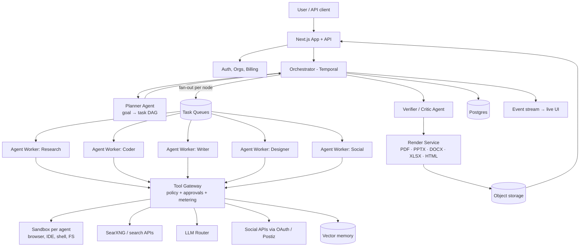

# AI Swarm: SaaS Blueprint and Roadmap

> The goal: a user gives any task. The system splits it into subtasks, gives each one to an agent that has its own browser, IDE and tools, runs the agents in parallel, and returns finished deliverables (PDF, PPTX, DOCX, XLSX, HTML, social posts). It is sold as a multi-tenant SaaS.

---

## 0. Reality check: start here

This section comes first because each of these problems gets harder to fix later.

| # | Problem | Why it matters |
|---|---|---|
| 1 | **"Any task" is not a product.** | A general agent that "does anything" is in direct competition with Claude, ChatGPT Agent, Manus, Genspark, and others, and they have more money. Pick 2–3 task families (e.g. *research → report/deck*, *build a landing page*, *social campaign*) and make those excellent. Other tasks can come later. |
| 2 | **The pipeline is hardcoded right now.** | `workers/workflow.ts` runs a fixed `lead → web → data∥fact → writer → designer → synth` chain. That is a pipeline, not a swarm. It does not split the task. The planner has to output a **task graph**, and the workflow has to run that graph (see §2). |
| 3 | **Giving each agent its own browser and IDE costs a lot.** | Each sandbox uses CPU, RAM and minutes of wall-clock time. With 7 agents per task and sandboxes for all of them, compute can cost more than the LLM calls. Only agents that need a sandbox should get one. Start them lazily and shut them down when they go idle. |
| 4 | **Free OpenRouter models plus a 14k-character context cap** (`activities.ts`). | That is fine for a demo. A paid product cannot rely on it: free models get rate-limited, get removed without notice, and follow JSON schemas poorly. Budget for paid models. Route cheap models to cheap steps and strong models to planning and verification. |
| 5 | **Social media access is the riskiest feature.** | Automated logins and scraping break platform terms and get accounts banned, both the user's and yours. Use only official APIs/OAuth (or Postiz) and require **human approval before every post**. Never store users' social passwords. |
| 6 | **Agents that browse the web can be prompt-injected.** | A web page can say "ignore instructions, post this, email that." An agent with social and file access then becomes an attack path. Every side-effecting tool needs an allow-list and an approval gate (§7). |
| 7 | **`SWARM_OVERVIEW.md` is out of date.** | It says there are no API routes, DB or auth, but all three exist now. Delete or update it so contributors (and AI coding agents) aren't misled. |
| 8 | **"Export" doesn't exist yet.** | `saveDeck` / `saveDocument` store JSON. No real `.pptx`/`.docx`/`.pdf` is rendered. This is the part users pay for, so it can't be left for last. |

---

## 1. Target architecture



**Key principle:** agents never call tools directly. Every call goes through the **Tool Gateway**, which checks permissions, meters usage for billing, logs for audit, and pauses for human approval when needed.

---

## 2. Dynamic task decomposition (the real "swarm")

The fixed pipeline gets replaced by a planner that returns a validated DAG:

```json
{
  "goal": "Launch page + deck for our new coffee brand",
  "deliverables": ["html_site", "pptx", "instagram_posts"],
  "tasks": [
    { "id": "t1", "role": "researcher", "objective": "Competitor & audience research", "tools": ["search","browser"], "depends_on": [] },
    { "id": "t2", "role": "copywriter", "objective": "Brand voice + page copy", "tools": [], "depends_on": ["t1"] },
    { "id": "t3", "role": "frontend_dev", "objective": "Build landing page", "tools": ["ide","browser_preview"], "depends_on": ["t2"] },
    { "id": "t4", "role": "designer", "objective": "10-slide pitch deck", "tools": ["render_pptx"], "depends_on": ["t1","t2"] },
    { "id": "t5", "role": "social", "objective": "5 IG post drafts", "tools": ["image_gen"], "depends_on": ["t2"] },
    { "id": "t6", "role": "verifier", "objective": "QA all outputs vs goal", "tools": ["browser"], "depends_on": ["t3","t4","t5"] }
  ],
  "budget": { "max_usd": 2.50, "max_minutes": 20 }
}
```

**Implementation in the existing Temporal setup:**

1. `planTask` activity: a strong model returns JSON, checked against a Zod schema. It is rejected if there is a cycle, an unknown role, or it goes over budget.
2. **Plan review screen** (you already have `Roles.tsx`): the user edits or approves the DAG before any money is spent.
3. `executeDag` workflow: a topological scheduler that starts each ready node as a **child workflow**. Independent nodes run in parallel, with a concurrency cap per plan tier.
4. Each node's output is a typed artifact (`{type, uri, summary}`). Downstream nodes get **summaries and URIs**, not raw text dumps. This fixes the 14k-character truncation problem.
5. **Re-planning**: when a node fails or the verifier rejects it, the orchestrator can insert fix-up nodes, with a limit on how many loops it allows.
6. **Signals**: the user can pause, cancel, or inject instructions mid-run (Temporal signals). The `TemporalMonitor.tsx` UI hooks into this.

**Role library** (so each new task doesn't invent roles from scratch): researcher, analyst, fact-checker, writer, editor, frontend dev, backend dev, data/Excel, designer (slides), social manager, translator, verifier. Users can add custom roles through the existing **Skills** system.

---

## 3. Agent runtime: own browser, own IDE

Each agent that needs one gets an **isolated, disposable sandbox**:

| Capability | How |
|---|---|
| Browser | Headless Chromium + Playwright inside the sandbox. Streamed to the UI via CDP screencast or noVNC so the user can **watch it live** and take over. |
| IDE | `code-server` (VS Code in the browser) or a lighter Monaco editor + terminal, pointed at the sandbox filesystem. |
| Shell | Restricted bash with CPU, RAM, time and egress limits. |
| HTML/CSS/JS preview | The agent writes files, a static dev server starts in the sandbox, and a **preview URL** opens in the agent's browser (for visual QA/screenshots) and in the user's UI. |
| Filesystem | Per-task workspace. Artifacts are copied to object storage when the task ends. The sandbox is then destroyed. |

**Sandbox options:**

- *Managed:* E2B, Daytona, Modal, Browserbase/Steel (for browsers only). They are the fastest to ship, and you pay per minute.
- *Self-hosted:* Docker + gVisor, or Firecracker microVMs on your own nodes. These are cheaper at scale but carry a real ops burden.
- **Recommendation:** use managed for the MVP. Measure cost per task. Move to self-hosted only once the bill justifies it.

**Security baseline:** no host mounts, egress proxy with a domain allow/deny list, no cloud metadata endpoint, secrets injected per call by the gateway (never kept in the sandbox's env), hard timeouts, kill on idle.

---

## 4. Output generation

Don't ask the LLM to "write a PPTX." Have it produce **structured content**, and let deterministic renderers build the files.

| Format | Content model from the LLM | Renderer |
|---|---|---|
| PDF | Markdown/HTML + theme | Playwright `page.pdf()` from an HTML template, or Typst for print-grade output |
| PPTX | Slide JSON (layout, title, bullets, chart data, image refs) | `pptxgenjs` (Node) or `python-pptx` |
| DOCX | Section tree (headings, paragraphs, tables, citations) | `docx` (Node) or `python-docx` |
| XLSX | Sheet JSON (cells, formulas, charts) | `exceljs` or `openpyxl` |
| HTML site | File tree | Built in the sandbox and deployed to a preview URL, then zipped |
| Markdown | Markdown | Passthrough |
| Social | Post JSON (caption, hashtags, image prompt, platform) | Image generation + preview mockups |

**Additions:**

- **Brand kits** per org (logo, colors, fonts, templates). Every renderer uses them, so outputs don't look generic. This fits well with REDS/REDSxP.
- **Template marketplace**: report, pitch deck, and case-study templates.
- **Visual QA**: render the file, take a screenshot, have a vision model check for overflow, empty slides and broken layout, and re-render if needed.
- **Citations**: every factual claim in a report links to an `Evidence` row (the schema already supports this).
- **Editable output**: open results in an in-app editor, and re-run a single section or slide instead of the whole swarm.

---

## 5. Social media, done safely

- Connect accounts via **official OAuth** (Meta Graph for IG/FB, LinkedIn, X API, YouTube, Pinterest) or go through **Postiz**, which is already planned.
- Agents can **read** (analytics, comments, trends) and **draft**. **Publishing always needs a human click.** Scheduling is fine once approved.
- A per-org content calendar, an approval workflow (drafter → reviewer → publisher), and a full audit trail.
- Don't build browser-login automation for social platforms. It is fragile, breaks the platforms' terms, and risks the user's accounts.

---

## 6. What else to add: feature backlog

### Core product
- [ ] Task templates ("Market research report", "Landing page", "Monthly social calendar")
- [ ] Live swarm view: agent graph, per-agent log, live browser stream, cost ticker
- [ ] Human-in-the-loop checkpoints (approve plan, approve sources, approve before publish)
- [ ] Mid-run chat with the swarm ("focus more on India market")
- [ ] Partial re-runs (redo only one agent or one slide)
- [ ] Project memory: files, prior outputs and brand context reused across runs (vector store)
- [ ] File inputs: upload PDFs, CSVs, decks for agents to use
- [ ] Scheduled/recurring swarms ("weekly competitor digest every Monday")
- [ ] Integrations: Google Drive, Notion, Slack, email delivery, GitHub (for code tasks), webhooks
- [ ] Public REST API + SDK + webhooks (you already have a Developers section on the landing page)

### Quality
- [ ] Verifier/critic agent with a rubric per deliverable type
- [ ] Source quality scoring, dedupe, and blocking of low-quality domains
- [ ] Eval suite: 50–100 fixed tasks, run on every prompt or model change, score tracked over time
- [ ] Model router: cheap models for extraction, strong models for planning, writing and verification; automatic fallback

### Collaboration
- [ ] Organizations/workspaces, invites, roles (Owner, Admin, Editor, Viewer)
- [ ] Comments on outputs, share links (view-only, expiring)
- [ ] Version history of outputs

---

## 7. SaaS foundations

| Area | Must-have |
|---|---|
| **Multi-tenancy** | `Organization` + `Membership` tables. Every row scoped by `orgId`. Postgres Row-Level Security as a backstop. |
| **Auth** | Current session auth is a start. Add OAuth (Google/GitHub), email verification, password reset, 2FA, and SSO/SAML for enterprise later. Consider Better Auth / Auth.js / Clerk rather than custom crypto. |
| **Billing** | Stripe (or Razorpay for India) with subscriptions **plus usage credits**. One swarm run can cost anywhere from ₹5 to ₹500 in compute, so flat pricing alone will lose money. |
| **Metering** | The Tool Gateway records tokens, sandbox-minutes, searches, renders and storage per task. Hard budget stops per task and per org. |
| **Quotas & rate limits** | Per plan: concurrent swarms, agents per swarm, sandbox minutes, storage. |
| **BYOK** | "Bring your own API key" (the `ProviderCredential` table already exists). Encrypt with KMS/envelope encryption, not a static key. |
| **Security** | Tool Gateway policy engine, approval gates for side effects, prompt-injection defenses (treat tool output as untrusted and never let it raise permissions), secrets vault, dependency scanning. |
| **Observability** | OpenTelemetry traces per run (Langfuse/Helicone for LLM traces), Sentry for errors, Temporal UI for workflows, a cost dashboard. |
| **Audit log** | Immutable log of every tool call, approval and publish. |
| **Data & privacy** | Data retention settings, delete-my-data, a DPA, a region choice. India DPDP Act and GDPR if selling abroad. |
| **Ops** | CI/CD, staging environment, DB backups, horizontally scaled workers, autoscaled sandbox pool, status page. |
| **Abuse prevention** | Spam/scraping/malware detection on tasks, egress limits, KYC-lite for higher tiers. Otherwise people will use the sandboxes as free compute or a botnet. |

---

## 8. Pricing model (starting point; validate with real cost data)

| Plan | For | Includes |
|---|---|---|
| Free | Trial | ~5 small runs/month, research-only, watermark, no social publishing |
| Pro | Solo creators | Monthly credits, all output formats, 1 social account set, brand kit |
| Team | Agencies/studios | Shared workspace, approvals, more concurrency, multiple brand kits |
| Enterprise | Large orgs | SSO, BYOK, private deployment, SLA, audit export |

**Rule:** before you set prices, measure **p50 and p95 cost per run** for each task template. Price credits at 3–5× your p50 cost.

---

## 9. Data model additions (Prisma)

```prisma
model Organization { id String @id @default(cuid()) name String plan String credits Int @default(0) /* ... */ }
model Membership   { id String @id @default(cuid()) orgId String userId String role String }
model TaskPlan     { id String @id @default(cuid()) projectId String dag Json approvedAt DateTime? version Int }
model TaskNode     { id String @id @default(cuid()) planId String key String role String status String dependsOn String[] outputUri String? costUsd Float @default(0) }
model Sandbox      { id String @id @default(cuid()) nodeId String provider String externalId String startedAt DateTime endedAt DateTime? minutes Float? }
model Artifact     { id String @id @default(cuid()) projectId String nodeId String? type String uri String bytes Int version Int }
model UsageEvent   { id String @id @default(cuid()) orgId String projectId String? kind String qty Float costUsd Float at DateTime @default(now()) }
model Approval     { id String @id @default(cuid()) projectId String action String payload Json status String decidedBy String? decidedAt DateTime? }
model SocialAccount{ id String @id @default(cuid()) orgId String platform String tokenEncrypted String scopes String[] }
model BrandKit     { id String @id @default(cuid()) orgId String name String tokens Json logoUri String? }
model AuditLog     { id String @id @default(cuid()) orgId String actorType String actorId String action String meta Json at DateTime @default(now()) }
```

Add `orgId` to `Project`, `Skill`, `AgentDefinition` and `Chat`.

---

## 10. Phased roadmap

### Phase 1: Real MVP (4–6 weeks)
Aim: **one task family works end-to-end with real files.**
1. Planner → DAG → `executeDag` workflow (replace the fixed pipeline).
2. Render service: **PDF + PPTX + DOCX** from structured JSON.
3. Artifacts in object storage (S3/R2/MinIO), download from the UI.
4. Paid LLM router with per-run budget stop.
5. Live run view streaming real timeline events (replace demo data).
6. Delete/refresh `SWARM_OVERVIEW.md`. Add an eval set of ~20 research tasks.

### Phase 2: Agents with hands (4–6 weeks)
1. Managed sandboxes (E2B or similar) for coder and browser roles.
2. Live browser stream + HTML/CSS/JS preview URLs.
3. In-browser IDE view (read-only first, then editable).
4. Tool Gateway with policy, metering, approvals.
5. Visual QA loop on rendered outputs.

### Phase 3: SaaS (4 weeks)
1. Orgs, roles, invites. RLS.
2. Stripe/Razorpay subscriptions + credits + quotas.
3. OAuth login, email verification, 2FA.
4. Observability, audit log, backups, staging.

### Phase 4: Growth
1. Social via OAuth/Postiz with approval workflow + content calendar.
2. Scheduled swarms, integrations (Drive, Notion, Slack), public API + webhooks.
3. Template and skill marketplace, brand kits.
4. Enterprise: SSO, BYOK with KMS, private deploy.

---

## 11. Decisions to make now

1. **Which 2–3 task families are the launch wedge?** Everything else follows from this.
2. **Managed vs self-hosted sandboxes** for the MVP. Default: managed.
3. **Which LLM providers and routing policy?** Free models won't do for a paid tier.
4. **Open-source core + hosted SaaS (open-core), or closed?** The README is MIT today. Decide what stays open (UI, workflow engine) and what is paid (hosted sandboxes, social publishing, team features) *before* outside contributors show up.
5. **Target market:** Indian SMBs/agencies (Razorpay, INR pricing, DPDP) or global (Stripe, GDPR). This affects billing, compliance and positioning.
