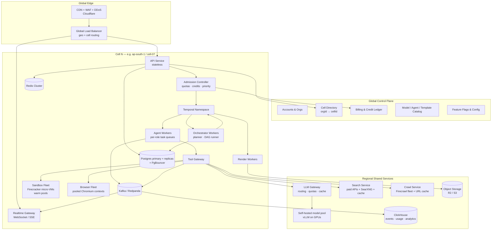
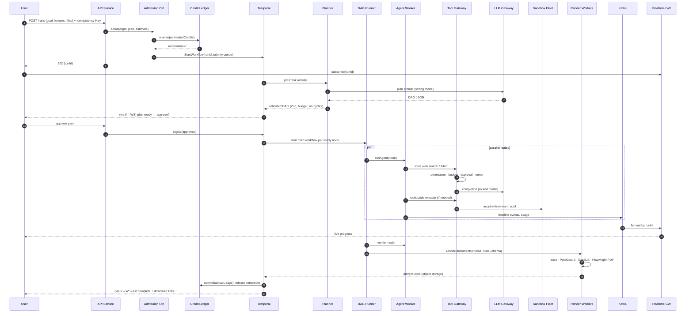

# AI Swarm: System Design

> **Scope:** end-to-end architecture and request flow for AI Swarm at **10 million registered users**, with around **1 million concurrent agents** at peak.
> **Companion docs:** `PROJECT_PLAN.md` (features, phases, build-vs-buy), `SAAS_ROADMAP.md`.

---

## 0. Read this first: what "a million workers" actually means

"Handle a million workers in any second" can mean three very different things. The design only works if we keep them separate:

| Meaning | Realistic? | How |
|---|---|---|
| **~1M logical agents alive at once** (planning, waiting on LLMs, reading, writing) | ✅ Yes | Agents are **durable workflow state** (Temporal), not processes. A waiting agent costs a DB row, not a CPU. |
| **~1M physical worker processes / containers** | ❌ No, and not needed | Tens of thousands of stateless worker pods serve millions of logical agents, because agents spend >90% of their time waiting on I/O. |
| **~1M sandboxes (browser/IDE VMs) started in the same second** | ❌ No | No cloud will give you that burst, and it would cost millions per hour. Sandboxes are **scarce, pooled, lazily started and admission-controlled**. |

**The real bottleneck at 10M users is not servers. It is LLM throughput and cost** (§2). Most of the design below exists to (a) shape load before it reaches LLMs and sandboxes, and (b) keep one tenant or one region from taking down the others.

**Don't build this all now.** The launch plan (PROJECT_PLAN §9) ships on a single managed stack. §14 lists the handful of decisions to make on **day one** so that reaching this scale is a matter of adding cells, not rewriting.

---

## 1. Requirements

### Functional
- Accept a task, plan it as a DAG, run agents in parallel, verify, render files (PDF/PPTX/DOCX/XLSX/HTML), and deliver them.
- Agents use tools through the Tool Gateway: search, fetch/crawl, browser, code sandbox, documents, memory, social.
- Live progress streaming, human approvals, pause/cancel, re-run a node.
- Multi-tenant orgs, billing with credits, quotas.

### Non-functional targets (at full scale)

| Metric | Target |
|---|---|
| Registered users | 10M |
| Peak concurrent runs | ~100k |
| Peak concurrent logical agents | ~1M |
| API availability | 99.95% (control plane), 99.9% (run execution) |
| API p95 latency (non-LLM endpoints) | < 200 ms |
| Run start latency (submit → first agent working) | p95 < 5 s |
| Sandbox acquire latency | p95 < 2 s (warm pool) |
| Live event latency (agent → user screen) | p95 < 1 s |
| Durability | No accepted run is lost. Every run resumes after any single-component failure. |
| RPO / RTO | RPO ≤ 5 min, RTO ≤ 30 min per cell |
| Tenant isolation | One noisy tenant can't cut another tenant's throughput by more than 10% |

---

## 2. Capacity estimates (back-of-envelope)

**Assumptions** (validate with real beta data, then update this table):

| Input | Value |
|---|---|
| Registered users | 10,000,000 |
| Daily active users (10%) | 1,000,000 |
| Runs per DAU per day | 2 |
| Peak-to-average factor | 5× |
| Avg run duration | 15 min (900 s) |
| Agents per run | 8 |
| LLM calls per agent | 15 |
| Tokens per LLM call | ~4k in, ~1k out |
| Agents needing a sandbox/browser | 25%, active ~50% of their lifetime |
| Artifacts per run | 5 × ~2 MB |

**Derived load:**

| Quantity | Calculation | Result |
|---|---|---|
| Runs/day | 1M × 2 | **2M** |
| Avg runs/s | 2M / 86,400 | ~23 |
| **Peak runs/s** | 23 × 5 | **~120** |
| **Concurrent runs (peak)** | 120 × 900 s (Little's law) | **~100k** |
| **Concurrent logical agents** | 100k × 8 | **~850k ≈ 1M** |
| **Peak LLM calls/s** | 120 × 8 × 15 | **~14,400** |
| Peak LLM input tokens/s | 14.4k × 4k | ~58M |
| Peak LLM output tokens/s | 14.4k × 1k | ~14M |
| **Concurrent sandboxes** | 850k × 25% × 50% | **~100k** |
| Sandbox vCPU (0.5–1 vCPU each) | | 50k–100k vCPU |
| Timeline events/s | 120 × 8 × 50 events | ~50k/s |
| Temporal actions/s | 120 × ~400 actions/run | ~50k/s (spread over cells) |
| Concurrent live viewers (WebSocket) | | 100k–500k |
| New artifact storage/day | 2M × 10 MB | ~20 TB/day (lifecycle rules required) |

**What this tells us:**
1. **LLM throughput (~58M input tokens/s) is far beyond any single provider account.** We need multi-provider routing, many accounts/regions, aggressive prompt caching, small-model routing, and a self-hosted open-model pool (vLLM) for cheap steps.
2. **Sandboxes are the second biggest cost.** Warm pools, micro-VMs, bin-packing and idle reaping are mandatory.
3. **Postgres must not be the event bus.** 50k events/s go to a log (Kafka/Redpanda). Postgres holds only current state.
4. **Storage grows by petabytes per year.** Retention per plan plus lifecycle to cold storage from day one.

---

## 3. High-level architecture: cell-based

The whole system is split into **cells**. A cell is a complete, independent copy of the execution stack serving a fixed set of organizations (~500k users each). A small **global control plane** routes each org to its cell.

Why cells:
- **Blast radius:** a bad deploy, hot tenant, or DB failure affects one cell (≤5% of users), not everyone.
- **Linear scaling:** 10M users ≈ 20 cells + spare. Growth means adding cells, not re-architecting.
- **Data residency:** cells live in a region (India / EU / US).
- **Known limits:** each cell is load-tested to a fixed size, so no component is ever pushed past what it was tested at.

---

## 4. End-to-end flow of a run

### 4.1 Sequence

### 4.2 Step by step

1. **Submit.** The client sends the task with an **Idempotency-Key**, so a retried request never creates two runs. The API looks up `orgId → cellId` (cached) and lands in the right cell.
2. **Admission.** The Admission Controller checks the org's concurrency quota, rate limit and plan tier. It **reserves credits** for the estimated cost. If the cell is overloaded, the run is **queued**, not rejected: the user sees "queued, position N". Free tier is shed first.
3. **Start.** A Temporal workflow is started with `workflowId = runId` (dedupes on retry) on a priority task queue (`enterprise`, `paid`, `free`).
4. **Plan.** The planner activity calls a strong model through the LLM Gateway and returns a DAG. It is validated for schema, cycles, role/tool allow-lists and budget. Optional human approval is a Temporal **signal**, and the workflow sleeps at zero cost while it waits.
5. **Execute.** The DAG runner starts a **child workflow per node** as dependencies clear, capped by the org's max-parallel setting. Each node's agent loop is a series of activities: LLM call → tool calls → LLM call...
6. **Tools.** Every tool call goes through the **Tool Gateway**: permission → domain policy → budget → side-effect approval → route → meter → audit event.
7. **Sandboxes.** Only when a node calls `code.*` or `browser.*`. A sandbox is taken from a warm pool, bound to the node, and released when the node finishes or goes idle.
8. **Events.** Agents and the gateway write timeline, usage and audit events to **Kafka**. Consumers push them to the Realtime Gateway (live UI), ClickHouse (analytics/usage), and Postgres (compact run summary only).
9. **Hand-off.** Nodes exchange **artifact references** (`artifactId` + summary), never large text blobs through workflow history.
10. **Render.** Render workers turn schemas into files, upload to object storage, and register versioned artifacts.
11. **Settle.** The workflow commits actual usage to the credit ledger and releases the unused reservation. Notifications fire.
12. **Failure paths.** Activities retry with backoff and jitter. A permanently failed node triggers re-planning (bounded) or marks the run `Failed` with partial artifacts. A cancelled run releases its sandboxes and credits via compensation.

---

## 5. Component design

### 5.1 Edge and API
- **Cloudflare**: CDN for static assets, WAF, bot protection, DDoS, geo-routing.
- **Next.js stays the web UI** (SSR/static on Vercel or containers). **Split the API into its own stateless service** once past Stage 1. Next.js API routes are fine for launch, not for 50k req/s.
- API pods: stateless, horizontal autoscaling on CPU + RPS. No in-memory sessions (JWT with short TTL + refresh token in Redis/DB).
- **Rate limits** at two layers: edge (per IP) and API (per user/org/API key, token bucket in Redis).

### 5.2 Admission Controller (critical for "a million agents")
The system survives peak load by **not starting work it can't finish**.
- Per-org concurrency limits (runs, agents, sandboxes) by plan.
- **Credit reservation** before start (no runaway spend, no negative balances).
- Global cell capacity signals: LLM gateway headroom, sandbox pool depth, Temporal backlog.
- **Priority queues** and **load shedding**: when saturated, free runs queue first, paid runs slow slightly, enterprise stays on SLA.
- **Fair scheduling**: weighted fair queuing per org, so one agency submitting 5,000 runs doesn't starve everyone else.

### 5.3 Orchestration: Temporal
- One **Temporal namespace per cell** (Temporal Cloud or self-hosted on Cassandra/Postgres with enough history shards). Confirm per-namespace throughput limits with the vendor and size cells to stay well under them.
- **Workflow shape:** `RunWorkflow` → `PlanActivity` → `DagRunner` → `NodeWorkflow` (child, one per agent) → activities.
- **Keep workflow history small:** pass IDs, not payloads. Use `continueAsNew` for long agent loops. Store large data in object storage/Postgres.
- **Task queues per capability** (`llm-light`, `llm-heavy`, `tools`, `sandbox`, `render`), so each worker pool scales independently.
- **Idempotent activities**: every side effect keyed by `(runId, nodeId, step)`.
- Timeouts at every level (activity, node, run) plus heartbeats for long activities.

### 5.4 Worker pools
- Stateless containers on Kubernetes, autoscaled by **KEDA on Temporal task-queue backlog**.
- Separate pools: orchestrator, agent (LLM-bound, high concurrency, low CPU), tool, render (CPU-heavy), py-tools (Docling).
- Agent workers are **async I/O-bound**: one pod can drive hundreds of concurrent agents waiting on LLM responses. That is how ~1M logical agents run on roughly ~5–20k pods.
- Spot/preemptible instances for render and batch pools (Temporal retries make preemption safe).

### 5.5 LLM Gateway (the true scaling limit)
- **Router:** chooses model by step type (planning/verification → strong; extraction/summarization → small/self-hosted).
- **Quota manager:** token buckets per provider × account × region × model. Spreads load across many provider accounts and regions.
- **Fallback + circuit breakers:** on 429/5xx, fail over to an equivalent model or provider.
- **Prompt caching:** stable system prompts + role instructions first, to maximize provider cache hits.
- **Semantic/exact cache** for repeated sub-queries (e.g. the same public page summary).
- **Self-hosted pool** (vLLM on GPUs) for high-volume cheap steps. It caps cost and removes provider rate limits for those steps.
- **Batch APIs** for non-interactive steps (scheduled runs, bulk jobs) at lower cost.
- Per-org spend metering. Requests carry `orgId`, `runId`, `nodeId` for attribution and Langfuse tracing (sampled at scale).

### 5.6 Tool Gateway
- Stateless service, horizontally scaled, **in-cell**.
- **Policy check** in memory from a cached policy bundle (OPA/Cedar-style rules: role → tools, domain allow/deny, side-effect class).
- **Budget check** against a Redis counter (reservation-backed). Reconciled from Kafka usage events.
- **Approval**: side-effect calls create an `Approval` record and signal the workflow to wait.
- **Audit + metering**: every call is emitted to Kafka (async, never blocks the call).
- Adapters: search, crawl, sandbox, browser, documents, memory, social, integrations.

### 5.7 Sandbox fleet (own IDE / shell)
- **Firecracker micro-VMs** (or managed E2B/Daytona in early stages) on bare-metal or metal instances, scheduled by a custom Sandbox Manager or Nomad/Kubernetes + Kata.
- **Warm pools** per image type (`node-python`, `web-dev`, `data`), pre-booted and **snapshot-restored** so acquiring one takes about a second.
- **Bin-packing** and oversubscription (most sandboxes are idle between commands).
- **Hard limits:** CPU, RAM, disk, wall time, egress through a filtering proxy, no metadata endpoint, no cross-tenant network.
- **Idle reaping** (e.g. 2–5 min idle → snapshot → destroy). Workspace persisted to object storage when needed.
- **Admission-controlled:** if the pool is empty, the node waits in queue. It never triggers an unbounded scale-up.

### 5.8 Browser fleet (own browser)
- Separate from code sandboxes: **pooled Chromium processes with many isolated browser contexts each** (one context per agent session, cookies/storage isolated).
- Sessions that need persistence or login get a **dedicated sandbox browser** (rare, more expensive tier).
- Live view via CDP screencast → Realtime Gateway. Recording stored as artifacts.
- Egress through the same filtering proxy. Downloads scanned before an agent can read them.

### 5.9 Search and crawl
- **SearXNG alone won't scale.** Upstream engines rate-limit and block high-volume metasearch. At scale, use **paid search APIs** as primary, SearXNG as a secondary source, and put a **shared query cache** (Redis, TTL hours) in front.
- **Crawl service:** Firecrawl fleet (or hosted API) + a **global URL content cache** keyed by normalized URL + TTL. Public pages fetched by thousands of agents are fetched once.
- Respect robots.txt and per-domain politeness (rate limit per target domain), both for ethics and to avoid IP bans.

### 5.10 Render workers
- CPU pool: PptxGenJS, docx, ExcelJS, Playwright PDF. Visual QA screenshots.
- Queue-driven, idempotent (`artifactId + version`). Output goes straight to object storage.
- Templates and fonts baked into the image, brand kits pulled from cache.

### 5.11 Realtime Gateway
- WebSocket/SSE servers, horizontally scaled, each holding tens of thousands of connections.
- Subscribe by `runId`. Events arrive from Kafka → a small fan-out consumer → **NATS or Redis pub/sub** keyed by `runId` → the connected node.
- Clients reconnect with `lastEventId`. Missed events are replayed from a short buffer (Redis stream) or read from ClickHouse.
- Coalesce high-frequency events (progress ticks) to ~1/s per run.

---

## 6. Data architecture

| Data | Store | Partitioning / notes |
|---|---|---|
| Users, orgs, memberships, billing accounts | **Global Postgres** (control plane) | Small, read-heavy, cached. Multi-AZ, cross-region replica. |
| Cell directory `orgId → cellId` | Global Postgres + edge/Redis cache | Changes rarely. Cached everywhere. |
| Projects, runs, DAG nodes, artifacts metadata, approvals | **Cell Postgres** | Every table keyed by `orgId`. Partition `runs`/`nodes` by month. PgBouncer in front. Read replicas for UI queries. |
| Workflow state | **Temporal** (per cell) | Source of truth for in-flight execution. |
| Timeline events, tool calls, usage, audit | **Kafka → ClickHouse** | Append-only, partitioned by `orgId`/date, TTL per plan. Audit also copied to immutable object storage. |
| Credit ledger | **Postgres (control plane), append-only** | `reserve / commit / release` entries with idempotency keys. Balance = materialized sum, reconciled from Kafka usage. |
| Memory / embeddings | **pgvector in cell Postgres** → dedicated vector DB beyond ~hundreds of millions of vectors | Partitioned by `orgId`. Always filtered by tenant. |
| Artifacts, uploads, recordings, sandbox snapshots | **Object storage** (R2/S3) | Key: `org/{orgId}/run/{runId}/...`. Lifecycle: hot → infrequent → archive → delete per plan. |
| Caches: sessions, rate limits, budgets, search/URL cache | **Redis Cluster** (per cell + regional) | Nothing in Redis is the only copy of anything important. |
| Analytics | **ClickHouse** | Usage dashboards, cost per run, agent/model stats. |

**Rules:**
- `orgId` on **every** row and every event. It is the tenant key, shard key and cell key.
- **Transactional outbox:** when a DB write must also emit an event, write the event to an `outbox` table in the same transaction and let a relay publish it to Kafka. No dual-write bugs.
- Postgres stores **current state**, not history. History lives in Kafka/ClickHouse.
- No large blobs in Postgres or in Temporal history.

---

## 7. Scaling strategy per layer

| Layer | Scales by | Limit / watch-out |
|---|---|---|
| Edge / API | Stateless horizontal pods | DB connections → PgBouncer, cache hot reads |
| Realtime | More WS nodes, pub/sub by runId | Connection count per node, event coalescing |
| Admission | Stateless + Redis counters | Hot-org counters → shard keys |
| Temporal | More cells (namespaces), more history shards | Per-namespace action limits, history size |
| Agent workers | KEDA on queue backlog | LLM gateway quota, not CPU |
| LLM | More providers/accounts/regions, self-hosted GPUs, caching | **Cost and provider capacity** |
| Tool Gateway | Stateless horizontal | Policy cache freshness |
| Sandboxes | More hosts, warm pools, snapshots | **Cost**, host capacity, start latency |
| Browsers | More contexts per process, more hosts | Memory per context, target-site blocking |
| Postgres | Per-cell DBs, replicas, partitioning | Write hotspots, connection limits |
| Kafka | Partitions by orgId/runId | Partition count planning |
| ClickHouse | Shards + replicas | Merge pressure, TTLs |
| Object storage | Effectively unlimited | Cost → lifecycle rules |

---

## 8. Reliability and failure handling

- **Every layer can retry safely:** idempotency keys on API, `workflowId = runId`, idempotent activities, dedup on event consumers.
- **Bulkheads:** separate worker pools, queues and connection pools per workload type and per priority tier. A render backlog can't starve LLM workers.
- **Circuit breakers** on every external dependency (LLM providers, search APIs, Firecrawl, social APIs).
- **Backpressure:** queues absorb spikes. Admission control stops intake before downstream saturation.
- **Graceful degradation order:** (1) disable visual QA, (2) route to cheaper models, (3) pause free-tier intake, (4) pause scheduled/batch runs, (5) queue paid runs. Never drop accepted runs.
- **Multi-AZ** for every stateful component in a cell. **Cross-region DR:** Postgres replicas + object storage replication + Temporal namespace failover (Temporal Cloud multi-region or a documented restore).
- **Cell evacuation:** the cell directory can move an org to another cell (drain → migrate data → flip routing).
- **Deploys:** progressive per cell (canary cell → 10% → all), automatic rollback on SLO burn.
- **Chaos testing:** kill workers, LLM provider outage simulation, sandbox pool exhaustion, Kafka broker loss.

---

## 9. Security and isolation at scale

- **Tenant isolation:** `orgId` scoping in every query + Postgres Row-Level Security as a backstop. Object storage keys prefixed by org with signed, short-lived URLs.
- **Sandbox isolation:** micro-VM boundary, no shared kernel between tenants, egress proxy with allow/deny lists, no instance metadata, per-call injected secrets, scan downloads/uploads.
- **Prompt-injection containment:** tool outputs are untrusted data and can't change permissions. Side-effecting tools always require policy + approval. Separate "read" and "act" credentials.
- **Secrets:** KMS envelope encryption for BYOK keys and social tokens. Secrets decrypted only inside the Tool Gateway at call time.
- **Abuse:** sign-up velocity checks, per-org egress quotas, crypto-mining/port-scan detection in sandboxes, content moderation on inputs/outputs, automatic suspension + review queue.
- **Compliance:** data residency by cell region (India DPDP, GDPR), audit export, retention controls, SOC 2 controls.

---

## 10. Observability

- **Traces:** OpenTelemetry end-to-end with `runId`, `nodeId` and `orgId` as trace attributes. LLM calls traced in Langfuse (sampled at scale, 100% for errors).
- **Metrics:** Prometheus/Grafana (or managed). Golden signals per service, plus business metrics: runs/s, run success rate, cost per run, queue depth per priority, sandbox pool depth, LLM tokens/s per provider, 429 rate.
- **Logs:** structured JSON → ClickHouse/Loki, sampled for high-volume paths.
- **SLOs + error budgets** per cell: run start latency, run success rate, event latency, API availability.
- **Per-run debug view** for support: timeline + tool calls + model calls + cost, with tenant consent.

---

## 11. Cost controls (this decides whether the business works)

| Lever | Effect |
|---|---|
| Model routing (small/self-hosted for most steps) | Largest single saving |
| Prompt caching + shared URL/search caches | Cuts repeated tokens and fetches |
| Sandboxes only when needed, warm-pool sizing, idle reaping | Avoids paying for idle VMs |
| Spot instances for render/batch | Cheaper CPU |
| Artifact lifecycle + retention per plan | Stops storage growing without limit |
| Credit reservation + hard per-run budget caps | No runaway runs |
| Batch APIs for non-interactive runs | Lower LLM price |
| Per-run cost in ClickHouse, reviewed weekly | Price plans from real p50/p95 cost |

---

## 12. Scaling stages (grow into it, don't build it on day one)

| Stage | Users | Architecture |
|---|---|---|
| **Stage 0: Launch** | 0–10k | 1 region, 1 "cell". Vercel (Next.js incl. API routes), managed Postgres (Neon/Supabase), Temporal Cloud, Upstash Redis, R2, managed sandboxes (E2B), hosted Firecrawl, paid LLM APIs. Events can still go to Postgres. |
| **Stage 1** | 10k–100k | Split API service from Next.js. PgBouncer + read replica. Kafka/Redpanda (managed) for events. ClickHouse (managed) for usage/analytics. Realtime gateway. KEDA-autoscaled workers on Kubernetes. LLM Gateway as its own service. |
| **Stage 2** | 100k–1M | **Cell architecture introduced** (2–3 cells). Global control plane + cell directory. Search/URL caches. First self-hosted vLLM pool. Sandbox warm pools, move heavy users to self-hosted Firecracker. Second region. |
| **Stage 3** | 1M–10M | ~20+ cells across 3 regions. Multi-provider LLM quota management across many accounts. Large GPU pool. Self-hosted sandbox and browser fleets. Dedicated vector DB if needed. Full DR drills, chaos testing, SOC 2. |

Move to the next stage when a **measured** metric (not a guess) crosses ~50% of the current stage's tested limit.

---

## 13. Load and capacity testing

- **Cell load test** before each stage: synthetic orgs submitting runs with a **mock LLM** (fixed latency distribution) to test orchestration, gateway, events and DB without paying for tokens.
- Separate **LLM provider soak tests** to learn real quotas/latency per account.
- **Sandbox burst test:** acquire N sandboxes/s from the warm pool and measure p95 acquire time and pool refill.
- **Realtime test:** N concurrent WebSocket clients per node, event fan-out latency.
- **Failure-injection runs** during load: kill a Postgres primary, drop an LLM provider, drain a cell.
- Record each cell's tested max. The Admission Controller enforces 70% of it.

---

## 14. Day-one decisions (cheap now, very expensive to change later)

These fit inside the ASAP launch plan and keep the path to 10M open:

1. **`orgId` on every table, event, object key and log line**, even for solo users (a personal org). This becomes the cell/shard key.
2. **Idempotency everywhere:** `Idempotency-Key` on `POST /runs`, `workflowId = runId`, idempotent activities.
3. **No payloads in Temporal history.** Pass IDs and artifact references (also fixes the current 14k-char truncation).
4. **Everything through `tools.*` + Tool Gateway + LLM Gateway**, so routing, quotas, caching and metering can be added without touching agents.
5. **Stateless services only.** No in-process state that a restart would lose.
6. **Artifacts in object storage**, never in Postgres.
7. **Events via an outbox → queue abstraction** (can be a Postgres table at launch, Kafka later), not direct `timelineEvent.create` calls scattered through activities.
8. **Credit reservation before a run starts** (reserve → commit → release), even in the free tier.
9. **Per-org concurrency limits in code from day one**, even if set generously.
10. **Prisma through a pooler** (PgBouncer / Prisma Accelerate) once running on serverless or many pods.

### Current code to change before scale

| Where | Issue | Fix |
|---|---|---|
| `workers/activities.ts` → `performSearch` | One `upsert` per search result inside a loop | Batch insert / `createMany` + conflict handling |
| `workers/activities.ts` → `runAgent` | Direct `timelineEvent.create` per event on the hot path | Emit to event outbox → queue. Postgres keeps summaries only |
| `workers/workflow.ts` | Passes accumulated `outputs` JSON between steps | Store as artifacts, pass `artifactId`s |
| `app/api/*` in Next.js | API and UI in one deployable | Fine for Stage 0. Split into an API service at Stage 1 |
| `lib/llm.ts` | Free-model chain, no quotas | Becomes the LLM Gateway client: routing, per-org metering, fallback, caching |

---

## 15. Open questions to settle with real data

1. Actual runs per DAU, agents per run and LLM calls per agent from the beta. Every number in §2 depends on these.
2. Sandbox share: what % of runs really need code/browser? It drives the second-biggest cost line.
3. Which LLM providers/accounts give the quota needed at Stage 2, and at what negotiated price?
4. Temporal Cloud vs self-hosted at Stage 2+ (cost vs ops effort).
5. Data residency: which regions must launch first (India first, then EU/US?).
